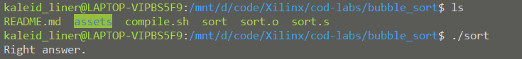
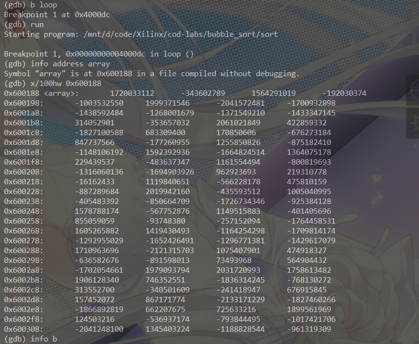
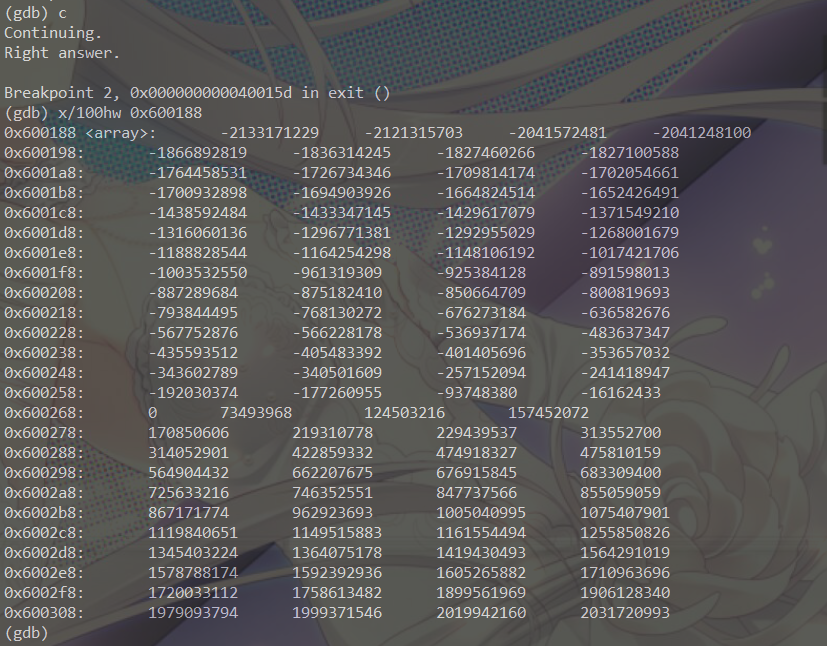
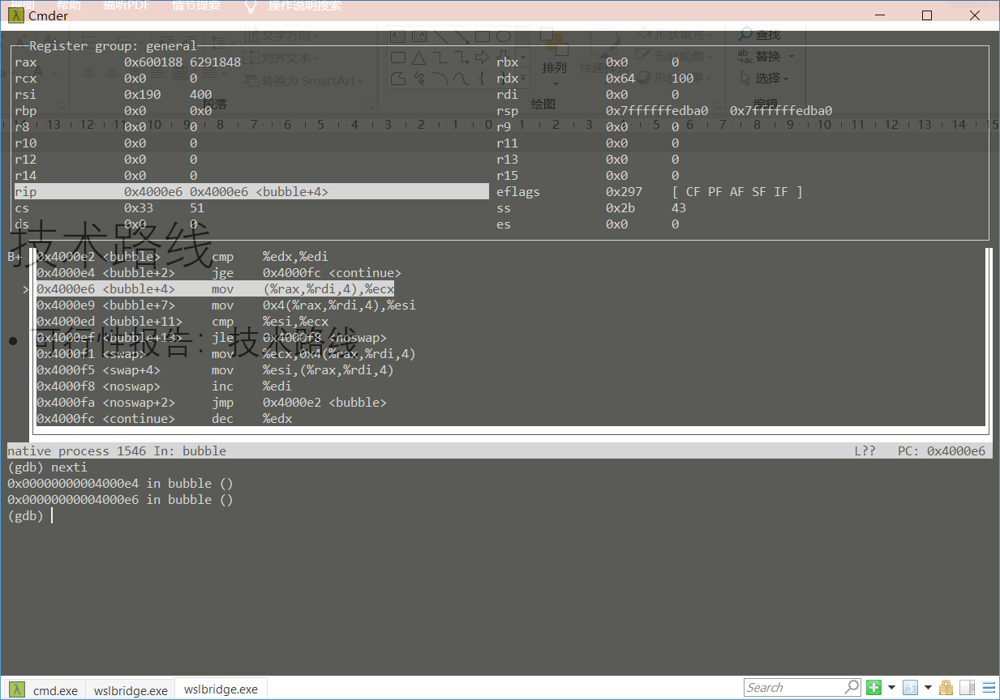
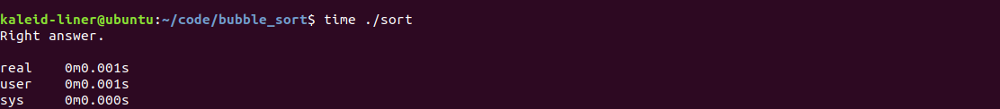
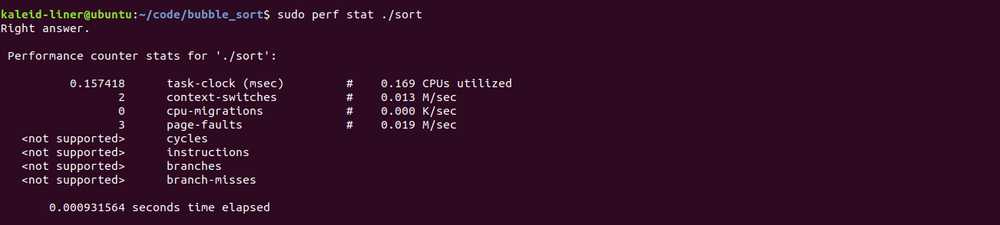

# X86_64 Bubble sort

[TOC]

本次冒泡排序的代码、报告和工具也可以在[我的Github repo](https://github.com/kaleid-liner/cod-labs/tree/master/bubble_sort)上找到。

## Design

由于个人之前就比较熟悉 x86 汇编的编写，并且 gdb 等工具也使用过，x86 方面的环境也比较普遍，所以我是用 x86 完成此次实验。

此次实验使用了一些 system call，参阅的文档主要是[这里][Linux Syscall Table]。

### Array input

由于我觉得此次实验不应该链接 libc，并且我也不想通过 `sys_read` 的系统调用来实现输入，所以索性直接将数组存入文件中。我通过

```assembly
section .bss
array: resd 100
```

来在 bss 中分配一块未初始化，double word（4字节），100大小的数组。

并且通过系统调用 `sys_getrandom` 来填充该数组：

```assembly
fill:
lea rdi, [array]
lea rsi, [400]
lea rdx, [1]
lea rax, [318]
syscall
```

`getrandom` 的 syscall number 是318. 几个参数分别是，数组首地址，大小和 flag。

在上面的代码中（以及之后的代码中），我大量使用 `lea` 来在寄存器中存入立即数（如`lea rdx, [1]`），主要是出于习惯原因和 `lea` 相对于 `mov` 的一些微小的优点（如指令长度较短）。

### Algorithm

首先，使用 `rax` 记录基地址（64位），使用 `dx` 记录外层循环的计数：

```assembly
mov rax, rdi
lea edx, [100]
```

外层循环通过以下代码实现条件判断和计数递减：

```assembly
loop:
    test edx, edx
    jz test
    
    ; --snippet--
    
    dec edx
    jmp loop
```

当 `edx == 0` 时跳出循环。注意 `test edx, edx` 是一个不写入值的 `and` 操作，但会设置 `flag` 。这里即用来监测 `edx` 是否为0.

内层循环主要是从 0 到 `edx - 1`，进行判断和交换。内层循环使用 `edi` 进行计数：

```assembly
 bubble:
     cmp edi, edx
     jge continue
     
     ; --snippet--
     
     inc edi
     jmp bubble
```

当 `edi >= edx` 时跳出循环。注意 `cmp` 是一个不写入值的 `sub` 操作，但会影响 `flag`。

之后是算法的核心部分，即进行比较和交换，如下所示：

```assembly
mov ecx, [rax+rdi*4]
mov esi, [rax+rdi*4+4]
cmp ecx, esi
jle noswap

swap:
mov [rax+rdi*4+4], ecx
mov [rax+rdi*4], esi
```

若 `ecx <= esi`，则什么也不用做，否则进行交换。注意交换的代码十分简单，不需要通过中间变量（寄存器）。

这样，逻辑部分的代码就写完了。

### Test

这里，我写了一个基本的测试：如果正确就输出 `Right answer.` ，否则输出 `wrong answer`。

首先考虑需要输出的字符串。在代码中插入字符串方式如下：

```assembly
section .data
    rmsg db "Right answer.", 0xa
    wmsg db "Wrong answer.", 0xa
    len equ $ - wmsg
```

其中，`rmsg` 和 `wmsg` 分别是正确情况和错误情况的输出。`0xa` 是换行符。其中，`len` 是字符串的长度，设为`$  - wmsg`。这里解释一下，`$`是指此处的地址，用 `$ - msg` 即此处的地址减去 `wmsg` 的地址，即该字符串的长度。

之后，判断是否正确的代码如下：

```assembly
test: ; test if right
    lea edi, [0]

    test_loop:
        cmp edi, 100
        jge right
        mov ecx, [rax+rdi*4]
        cmp ecx, [rax+rdi*4+4]
        jg wrong
        inc edi
        jmp test_loop
```

只需要，从 0 开始到 99，判断是否是递增的。若到了最后说明符合，中间某一处不符合说明错误。

输出的代码如下：

```assembly
wrong:
mov edx, len
mov rsi, wmsg
lea rdi, [1]
lea rax, [1]
syscall
jmp exit

right:
mov edx, len
mov rsi, rmsg
lea rdi, [1]
lea rax, [1]
syscall

exit:
; --snippet--
```

这里使用 `sys_write` （syscall number 为1）进行输出。参数有地址，长度，file discriptor。这里设为1，即为 `stdout`。

### Exit

通过 `sys_exit`(syscall number 为 60) 进行退出：

```assembly
exit:
    xor rdi, rdi
    lea rax, [60]
    syscall
```

### Code

整体实现完了，事实上用于冒泡排序的部分30几行就能搞定，其它如填充数组和测试输出占了很多。完整代码如下：

```assembly
section .bss

    array: resd 100

section .data
    rmsg db "Right answer.", 0xa
    wmsg db "Wrong answer.", 0xa
    len equ $ - wmsg

section .text
global _start

_start:

    fill:
    lea rdi, [array]
    lea rsi, [400]
    lea rdx, [1]
    lea rax, [318]
    syscall

    mov rax, rdi
    lea edx, [100]
    
    loop:
        test edx, edx
        jz test

        xor edi, edi
        bubble:
            cmp edi, edx
            jge continue

            mov ecx, [rax+rdi*4]
            mov esi, [rax+rdi*4+4]
            cmp ecx, esi
            jle noswap

            swap:
            mov [rax+rdi*4+4], ecx
            mov [rax+rdi*4], esi

            noswap:
            inc edi
            jmp bubble

        continue:
        dec edx
        jmp loop

    test: ; test if right
        lea edi, [0]

        test_loop:
            cmp edi, 100
            jge right
            mov ecx, [rax+rdi*4]
            cmp ecx, [rax+rdi*4+4]
            jg wrong
            inc edi
            jmp test_loop

    wrong:
    mov edx, len
    mov rsi, wmsg
    lea rdi, [1]
    lea rax, [1]
    syscall
    jmp exit

    right:
    mov edx, len
    mov rsi, rmsg
    lea rdi, [1]
    lea rax, [1]
    syscall
    
    exit:

    xor rdi, rdi
    lea rax, [60]
    syscall
```

## Assemble

需要进行汇编和链接生成可执行程序。命令如下所示：

```shell
$ nasm -f elf64 -g sort.s -o sort.o
$ ld sort.o -o sort
```

这里生成 ELF 格式的可执行文件。我使用了 64 位，主要是因为在 WSL 下生成 32 位程序有点麻烦。同时使用 `-g` 选项添加符号信息，方便调试。

由于生成比较简单这里没有使用 Makefile，助教在 linux 环境下我打包的文件下运行 `./compile.sh` 即可完成汇编。

## Debug

运行程序，发现程序至少通过了我的初步测试：



这里，我在 WSL Ubuntu 18.04 上使用 `gdb` 进行调试。

首先，在外层循环入口设下断点，并运行程序，之后观察我使用随机值填充的 100 大小的数组。如下所示：



这里执行了命令：

```
(gdb) b loop
(gdb) run
(gdb) info address array
(gdb) x/100hw 0x600188
```

其中，通过 `info address` 获取 `array` label 地址，并通过 `x/100hw` 读取该处内存的内容。在 `x/100hw` 中，100 指大小，h 指有符号整数值，w 指 word，在这里一个 word 是四个字节。

之后，我在结束处设置了断点，并运行至该处，再次查看数组内容，如下所示，可以发现好好地排成了由小到大的顺序：



实际上，在写程序的时候出了一两个小 bug。通过 `gdb` 也可以很好的调试。执行命令 `layout regs`，可以得到信息量充足的界面，如下所示：



通过 `nexti`/`stepi` 可以依次执行命令，按下 `<enter>` 重复上一条 gdb 命令。由于添加了符号信息，图中的界面还是很友好的。

## Timing and Profile

由于 WSL 效率感人，并且对 profile 的支持很差，并且我不想麻烦地打开我的 linux 系统，所以在虚拟机上完成测试（VMWare）。

首先，简单地通过 `time ./sort` 看一下大致的时间，发现在 1ms 左右。



之后，使用 linux 下的 `perf` 工具进行详细的 profile。由于是虚拟环境，许多 perf 特性无法支持，所以只能得到部分的信息。

发现时间在 0.000931564s 左右，消耗的 CPU 时间为 0.157418 ms。



现在想想不如直接在我的 Windows 上 assemble，用 VTune 进行 profile，但以上已经足够了，profile 不是重点所以没有继续去做。

## Reference

- [Linux Syscall Table](https://blog.rchapman.org/posts/Linux_System_Call_Table_for_x86_64/)

[Linux Syscall Table]: https://blog.rchapman.org/posts/Linux_System_Call_Table_for_x86_64/	"Linux Syscall Table"