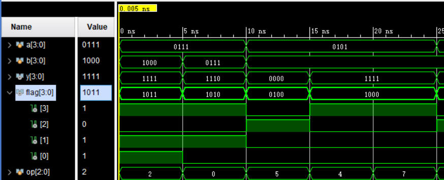
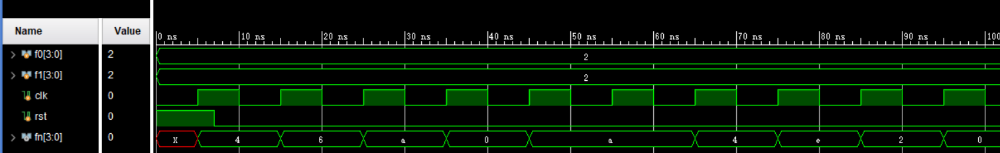

# Lab1 运算器与寄存器

- **姓名**：魏剑宇
- **学号**：PB17111586

---

## 逻辑设计 & 核心代码

### 1. ALU

ALU的运算比较好实现，用verilog的内置运算符就可以了。至于解码，则可以使用`case`语句实现，如下

```verilog
case (opcode)
    `ADD: //do something
    `SUB: //...
    // --snippet
endcase
```

关于四个标志位，SF、ZF、CF、OF，则需要用到数电的知识。

为了使OF在加和减的情况下都能保证正确，需要分别赋值

```verilog
// add
of = (a[BITS-1] & b[BITS-1] & ~y[BITS-1])
    | (~a[BITS-1] & ~b[BITS-1] & y[BITS-1]);
   
// sub
of = (a[BITS-1] & ~b[BITS-1] & ~y[BITS-1])
   | (~a[BITS-1] & b[BITS-1] | y[BITS-1]);
```

ZF比较简单，`assign ZF = !y`即可。`assign SF = y[BITS-1]`，`assign CF = carry`。只不过在与、或、非时要注意OF和CF的值。

ALU另外需要考虑的就是位数。这里我将位数设成参数`parameter BITS = 4`。可以根据实例的需要进行更改。

### 2. Register

最简单的寄存器实现方式就是一个D flip flop。这个在上学期实现过很多次了，这里就不再赘述了。完整代码在下面。

### 3.a. 比较器

这个在ALU的flag的帮助下非常好实现，基本的逻辑如下，

```verilog
assign eq = zf;
assign ul = cf;
assign ug = ~cf & ~zf;
assign sl = sf ^ of;
assign sg = (sf ^~ of) & ~zf;
```

### 3.b. 累加器

此题只需要使用一个寄存器，保存上一次相加获得的结果即可。每一次类似于执行sum = s + x, s = sum。可以使用简单的时序逻辑实现。核心部分代码如下。

```verilog
always @ (posedge clk) begin
    if (rst) 
        s <= 0;
    else 
        s <= sum;
end

alu #(BITS) ADD_ALU_ACM (
    .a(x),
    .b(s),
    .y(sum),
    .op(`ADD)
);
```

### 3.c. Fibonacci

这题的难点是想清楚应该如何置数。我是在`rst`按下时进行初始化，将`f0`、`f1`放入寄存器内，之后就不再用到。维护一个cur和prev数即可。

```verilog
alu #(BITS) ADD_ALU_FIB (
    .a(cur),
    .b(prev),
    .y(fn),
    .op(`ADD)
);

always @(posedge clk) begin
    if (rst) begin
        cur <= f1;
        prev <= f0;
    end
    else begin
        cur <= fn;
        prev = cur;
    end
end
```

## 完整代码

### 1. ALU

```verilog
`include "Define.vh"

module alu(
    input [BITS-1:0] a,
    input [BITS-1:0] b,
    input [`ALU_OP_BITS-1:0] op,
    output reg [BITS-1:0] y,
    output [`FLAG_BITS-1:0] flag
    );

    parameter BITS = 4; // as parameter, can vary with instances

    reg [BITS:0] temp_y;

    wire zf = !y;
    wire sf = y[BITS-1];
    reg of;
    reg cf;
    reg carry;

    assign flag = (zf << `ZF_BIT) | (of << `OF_BIT) | (cf << `CF_BIT) | (sf << `SF_BIT);

    always @(*) begin 
        case (op) 
            `ADD: begin
                {carry, y} = a + b;
                of = (a[BITS-1] & b[BITS-1] & ~y[BITS-1])
                   | (~a[BITS-1] & ~b[BITS-1] & y[BITS-1]);
                cf = carry;
            end
            `SUB: begin
                {carry, y} = a - b;
                of = (a[BITS-1] & ~b[BITS-1] & ~y[BITS-1])
                   | (~a[BITS-1] & b[BITS-1] | y[BITS-1]);
                cf = carry;
            end
            `AND: begin
                {carry, y} = a & b;
                of = 0;
                cf = 0;
            end
            `OR: begin
                {carry, y} = a | b;
                of = 0;
                cf = 0;
            end
            `XOR: begin
                {carry, y} = a ^ b;
                of = 0;
                cf = 0;
            end
            `NOT: begin
                {carry, y} = ~a;
                of = 0;
                cf = 0;
            end
            default: begin
                {carry, y} = 0;
                of = 0;
                cf = 0;
            end
        endcase
    end

endmodule
```

```verilog
/*
	define.vh
*/

`define ALU_OP_BITS 3
`define FLAG_BITS 4

/*
    op codes
*/
`define ADD 3'd0
`define SUB 3'd2
`define OR 3'd4
`define AND 3'd5
`define NOT 3'd6
`define XOR 3'd7

/*
    flags
*/
`define CF 1
`define OF 2
`define ZF 4
`define SF 8     // x86 sign flag
`define CF_BIT 0
`define OF_BIT 1
`define ZF_BIT 2
`define SF_BIT 3
```

### 2. 寄存器

```verilog
module register(
    input [BITS-1:0] in,
    input en,
    input rst,
    input clk,
    output reg [BITS-1:0] out
    );

    parameter BITS = 32;

    always @ (posedge clk) begin
        if (rst)
            out <= 0;
        else if (en) 
            out <= in;
    end

endmodule

```

### 3.a. 比较器

```verilog
`include "Define.vh"

module cmp(
    input [BITS-1:0] a,
    input [BITS-1:0] b,
    output ug,
    output ul,
    output sg,
    output sl,
    output eq
    );

    parameter BITS = 32;

    wire [BITS-1:0] y;
    wire [`FLAG_BITS-1:0] flag;

    alu #(BITS) du (
        .a(a),
        .b(b),
        .op(`SUB),
        .y(y),
        .flag(flag)
    );

    wire zf = flag[`ZF_BIT];
    wire cf = flag[`CF_BIT];
    wire of = flag[`OF_BIT];
    wire sf = flag[`SF_BIT];

    assign eq = zf;
    assign ul = cf;
    assign ug = ~cf & ~zf;
    assign sl = sf ^ of;
    assign sg = (sf ^~ of) & ~zf;
    
endmodule
```

### 3.b. 求累加和

```verilog
// acm.v

`timescale 1ns / 1ps

`include "Define.vh"

module acm(
    input [BITS-1:0] x,
    input rst,
    input clk,
    output reg [BITS-1:0] s
    );

    parameter BITS = 32;

    wire [BITS-1:0] sum;
    alu #(BITS) ADD_ALU_ACM (
        .a(x),
        .b(s),
        .y(sum),
        .op(`ADD)
    );

    initial begin
        s = 0;
    end

    always @ (posedge clk) begin
        if (rst) 
            s <= 0;
        else 
            s <= sum;
    end

endmodule
```

### 3.c. Fibonacci

```verilog
`include "Define.vh"

module fib(
    input [BITS-1:0] f0,
    input [BITS-1:0] f1,
    input rst,
    input clk,
    output [BITS-1:0] fn
);

    parameter BITS = 4;

    wire [BITS-1:0] f2;

    reg [BITS-1:0] cur, prev;
    
    alu #(BITS) ADD_ALU_FIB (
        .a(cur),
        .b(prev),
        .y(fn),
        .op(`ADD)
    );
    
    always @(posedge clk) begin
        if (rst) begin
            cur <= f1;
            prev <= f0;
        end
        else begin
            cur <= fn;
            prev = cur;
        end
    end

endmodule
```

## 仿真结果及分析

### ALU



- 0~5ns内，y = a - b，OF和CF都为1，SF为1
- 5~10ns内，y = a + b，OF为1，CF为0，SF为1
- 之后的同样分析，发现符合预期。

### Fibonacci



从`rst`置1，clk上升沿完成初始化。这里f0 = f1 = 2，发现2 + 2 = 4， 2 + 4 = 6， 4 + 6 = 10 ... 与预期相符。

## 实验总结

在这次实验中，我学到了

- 实现ALU，了解了ALU的一般实现方法，进位溢出等符号的处理
- 实现了时序逻辑结构的Register
- 使用ALU和寄存器完成了一些相对的高级功能，如比较、输出fibonacci数列等。