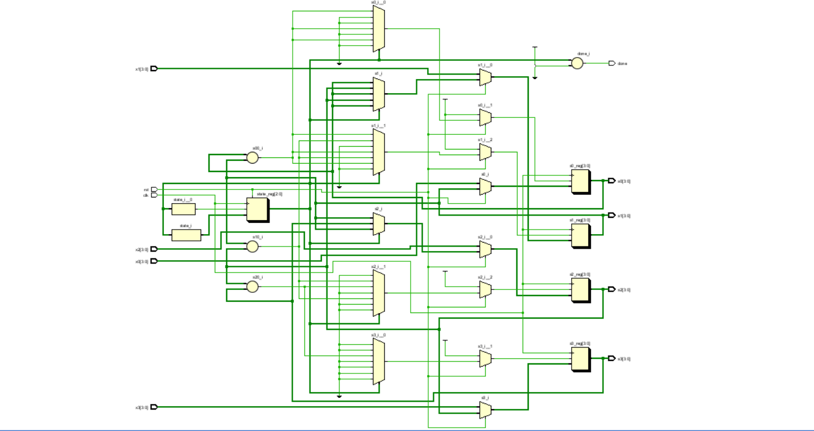
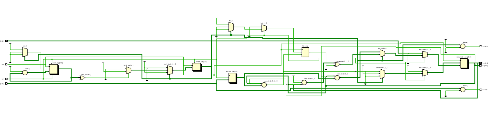
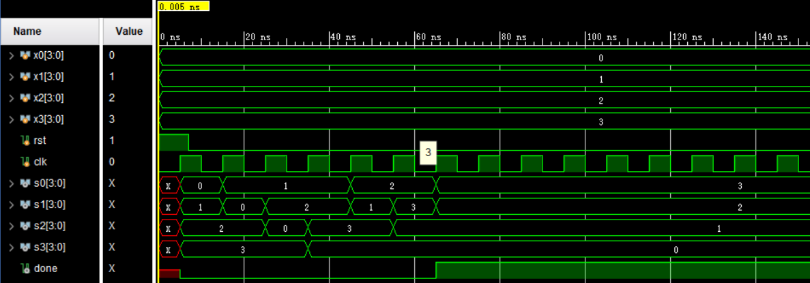
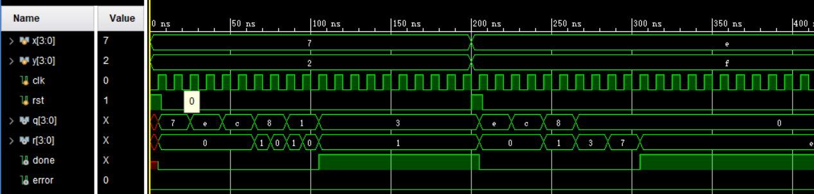

# Lab2 数据通路与状态机

- **姓名**：魏剑宇
- **学号**：PB17111586

---

## 逻辑设计 & 核心代码

### 1. Sort

应用状态机，定义如下状态

```verilog
localparam CMP01   = 4'd0,
           CMP12   = 4'd1,
           CMP23   = 4'd2,
           CMP01_2 = 4'd3,
           CMP12_2 = 4'd4,
           CMP01_3 = 4'd5,
           DONE    = 4'd6;
```

这里，我是用的算法是冒泡排序，需要6次比较，并用`DONE`状态表示结束。

当按下`rst` 时同步完成初始化，如下

```verilog
if (rst) begin
    state <= CMP01;
    s0 <= x0;
    s1 <= x1;
    s2 <= x2;
    s3 <= x3;
end
```

 之后不会用到`x0`、`x1`、`x2`、`x3`，下面是当`state == CMP01`时所作的事情

```verilog
CMP01: begin           
    state <= CMP12;    
    if (s0 < s1) begin 
        s0 <= s1;      
        s1 <= s0;      
    end                
end                    
```

其他状态下类似，注意这里通过非阻塞赋值可以直接完成交换的操作。（虽然在C里面这是显然做不到的）

生成的原理图如下



### 2. Div

除法器的算法在 *Computer Organization and Design* 一书上可以找到，这里我是用的是书上除法器的改进算法。循环中涉及到两个状态，并用一个`SDone`状态表示结束。

```verilog
localparam SSub = 0, 
           SShl = 1, 
           SDone = 2;
```

这里我使用了**三段式**。使用一个`cnt`用于计数，总共需要循环5次，当循环5此后，就可以Done了。如下是初始化操作

```verilog
if (rst) begin
    remainder <= {4'd0, x};
    divisor <= y;
    cnt <= 5;
end
```

如下是状态的变化：

```verilog
always @(state or cnt or rst) begin
    case (state) 
        SSub: next_state = SShl;
        SShl: begin
            if (cnt)
                next_state = SSub;
            else    
                next_state = SDone;
        end
        default:
            next_state = SDone;
    endcase
end
```

算法大致是，首先在判断 `remainder`的高四位是否比 `divisor` 大，若是则减掉。并基于此，在把 `remainder`  左移后将 `quotient` 置为0或1。如下所示。

```verilog
case (state)                                           
    SSub: begin                                        
        cnt <= cnt - 1;                                
        if (remainder[7:4] >= divisor) begin           
            lsb <= 1;                                  
            remainder[7:4] <= remainder[7:4] - divisor;
        end else                                       
            lsb <= 0;                                  
    end                                                
    SShl: begin                                        
        remainder <= (remainder << 1) | {8'd0, lsb};   
    end                                                
    default: ;                                         
endcase                                                
```

这里 `remainder` 的类型是`reg [8:0]`，高一位用于保留左移的一位。（因为余数会比商多左移一位）。这样，做完之后，商和余数可以这样得到：

```verilog
assign q = remainder[3:0];
assign r = remainder[8:5];
```

原理图如下所示：



## 完整代码

### 1. Sort

```verilog
/*
	sort.v
*/

module sort(
    input [3:0] x0,
    input [3:0] x1,
    input [3:0] x2,
    input [3:0] x3,
    input rst,
    input clk,
    output reg [3:0] s0,
    output reg [3:0] s1,
    output reg [3:0] s2,
    output reg [3:0] s3,
    output done
    );
    
    localparam CMP01   = 4'd0,
               CMP12   = 4'd1,
               CMP23   = 4'd2,
               CMP01_2 = 4'd3,
               CMP12_2 = 4'd4,
               CMP01_3 = 4'd5,
               DONE    = 4'd6;
    
    reg [2:0] state;
    
    always @ (posedge clk) begin
        if (rst) begin
            state <= CMP01;
            s0 <= x0;
            s1 <= x1;
            s2 <= x2;
            s3 <= x3;
        end
        else begin
            case (state)
                CMP01: begin
                    state <= CMP12;
                    if (s0 < s1) begin
                        s0 <= s1;
                        s1 <= s0;
                    end
                end
                CMP12: begin
                    state <= CMP23;
                    if (s1 < s2) begin
                        s1 <= s2;
                        s2 <= s1;
                    end
                end
                CMP23: begin
                    state <= CMP01_2;
                    if (s2 < s3) begin
                        s2 <= s3;
                        s3 <= s2;
                    end
                end
                CMP01_2: begin
                    state <= CMP12_2;
                    if (s0 < s1) begin
                        s0 <= s1;
                        s1 <= s0;
                    end
                end
                CMP12_2: begin
                    state <= CMP01_3;
                    if (s1 < s2) begin
                        s1 <= s2;
                        s2 <= s1;
                    end
                end
                CMP01_3: begin
                    state <= DONE;
                    if (s0 < s1) begin
                        s0 <= s1;
                        s1 <= s0;
                    end
                end
                default: ;
            endcase
        end
    end

    assign done = (state == DONE);

endmodule
```

### 2. Div

```verilog
/*
	div.v
*/

module div(
    input [3:0] x,
    input [3:0] y,
    input rst,
    input clk,
    output [3:0] q,
    output [3:0] r,
    output done,
    output error
    );

    localparam SSub = 0,
               SShl = 1,
               SDone = 2;
    
    reg [8:0] remainder;
    reg [3:0] divisor;
    reg [2:0] cnt;
    reg [1:0] state, next_state;
    reg lsb;
    
    assign error = !y;
    assign done = (state == SDone);

    assign q = remainder[3:0];
    assign r = remainder[8:5];

    always @(state or cnt or rst) begin
        case (state) 
            SSub: next_state = SShl;
            SShl: begin
                if (cnt)
                    next_state = SSub;
                else    
                    next_state = SDone;
            end
            default:
                next_state = SDone;
        endcase
    end

    always @(posedge clk) begin
        if (rst) begin
            remainder <= {4'd0, x};
            divisor <= y;
            cnt <= 5;
        end
        else begin
            case (state)
                SSub: begin
                    cnt <= cnt - 1;
                    if (remainder[7:4] >= divisor) begin
                        lsb <= 1;
                        remainder[7:4] <= remainder[7:4] - divisor;
                    end else 
                        lsb <= 0;
                end
                SShl: begin
                    remainder <= (remainder << 1) | {8'd0, lsb};
                end
                default: ;
            endcase
        end
    end
    
    always @(posedge clk)
        if (rst) state <= SSub;
        else state <= next_state;
    
endmodule
```

## 仿真结果及分析

### 1. Sort

如下，输入0，1，2，3最后得到3，2，1，0.



### 2. Div

如下，有两个测试：

- 7 / 2 = 3...1
- 14 / 15 = 0...14



## 下载结果


## 实验总结

- 经过这次试验，熟练地掌握了有状态机和数据通路构成的系统的写法。
- 能熟练地使用两段式、三段式写状态机。