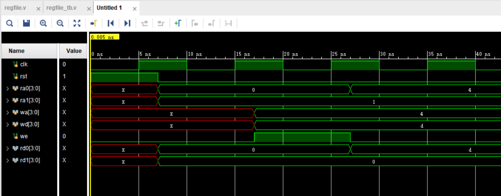
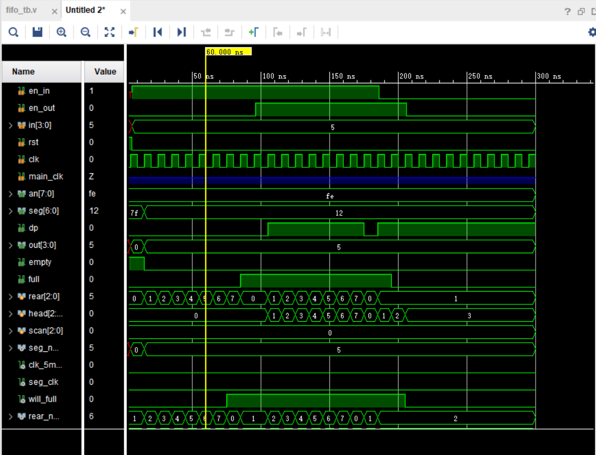

# Lab3 寄存器堆与计数器

## 逻辑设计 & 核心代码

### 1. Regfile

regfile 是寄存器组，本质上就是一系列的寄存器组合在一起。因此，定义 regfile 就可以这样定义：

```verilog
reg [BITS-1:0] regs [SIZE-1:0];
```

以上表示，有 `SIZE` 个寄存器，每个寄存器的位宽为 `BITS`。

在访问和修改寄存器组时，需要提供地址。地址的位数应有大小确定。在我的代码中都将其设为了参数便于扩展和重用。

为了实现异步读，只需要简单的组合逻辑：

```verilog
assign rDout0 = regs[rAddr0];
assign rDout1 = regs[rAddr1];
```

写寄存器需要用到时时序逻辑：

```verilog
always @(posedge clk) begin
    if (rst) begin
        for (i = 0; i < SIZE; i = i + 1) begin
            regs[i] <= 32'd0;
        end
    end
    else if (wEn) begin
        regs[wAddr] <= wDin;
    end
end
```

即在 `rst` 时将所有寄存器置为 0。注意，这里的 for 语句会综合为 `SIZE` 个并行的赋值语句。在写使能时，在对应地址写入读入的值。

 ### 2. Counter

额，写一个计数器比较简单，事实上在上学期前几次实验就写过，使用非常简单的时序逻辑就可实现：

```verilog
always @ (posedge clk or rst) begin
    if (rst) begin
        q <= 0;
    end else if (pe) begin
        q <= din;
    end else if (ce) begin
        q <= q + 1;
    end
end
```

通过 ce 实现计数，通过 rst 实现异步清零，通过 pe 实现同步置数。

### 3. FIFO

#### 入队和出队

我实现的先进先出队列最特殊的地方是可以同时入队，同时出队。由于 verilog 符合底层电路并行性的特点，这个是可以非常自然的实现的。

时序逻辑的部分非常简单：

```verilog
always @(posedge clk) begin
    if (rst) begin
        full <= 0;
        head <= 0;
        rear <= 0;
    end else begin
        if (can_in) begin
            rear <= rear + 1;
        end
        if (can_out) begin
            head <= head + 1;
        end
        if (can_in && !can_out) begin
            full <= will_full;
        end else if (!can_in && can_out) begin
            full <= 0;
        end 
    end
end
```

即在可以入队时，将队尾加 1，在可以出对时，将队首加 1。至于什么时候可以入队，什么时候可以出对入队只需满足以下几个条件之一：

1. 队伍未满，并且拨下了入队开关
2. 队伍已满，同时拨下了入队开关和出队开关

这样，实现起来就是：

```verilog
assign can_in = (en_in & ~full) | (en_in & en_out);
```

出队情况类似。

#### `full` or `empty`

由于 FIFO 的性质，当队首等于队尾时，队伍既可能是空，也可能是满。若不使用多留一个寄存器的实现方法，就要通过 flag 来判断队伍是空还是满。这里，我通过详细判断队伍是否为满，这样判断空的条件就可以是：

```verilog
assign empty = (rear == head) & ~full;
```

至于如何判断队伍是否为满——观察发现，只有在队伍【只有入队 | 只有出队】这两种情况下 full 才会发生变化，因此就有：

```verilog
if (can_in && !can_out) begin
    full <= will_full;
end else if (!can_in && can_out) begin
    full <= 0;
end 
```

`will_full` 的值为：

```verilog
assign will_full = (rear_next == head) | full;
```

即若队尾加 1 就等于队首和队伍本来就已经是满的这两种情况。

#### Display

此实验还需要将结果现实到七段数码管上。上学期已经写过了在 8 个数码管上显示数字的代码，这里不详细介绍，只说明一下改动的部分。

首先是小数点的位置。应该只有队首才显示小数点。故可以：

```verilog
assign dp = !(index == head);
```

`index` 是当前正在渲染的数码管。

使数码管亮的方法是 `index` 依次扫描所有 8 个数码管，并输入该处的数据：

```verilog

seg_displayer seg_dis (
    .x(seg_num),
    .index(scan),
    .head(head),
    .empty(empty),
    .an(an),
    .dp(dp),
    .seg(seg)
);
```

其中，`scan` 正是一个随着 500hz 的时钟从 1-8 的数字。另一个需要注意的是，当 `empty` 为真时，此时任何一个数码管上的数字都不应该亮，但小数点却可能需要亮，所以需要对 7 个数码管都或上一个 `empty`，如：

```verilog
assign seg[0] = empty | ((x[0] & ~x[1] & ~x[2] & ~x[3]) | (~x[0] & ~x[1] & x[2] & ~x[3]));
```

或的原因是 seg 是低电平有效。

至于调整 8 个数码管哪个亮的部分，应该这样写：

```verilog
genvar i;
generate for (i = 0; i < 8; i = i + 1) begin
    assign an[i] = !(i == index);
end
```

这里使用 `genvar` 和 `generate for` ，这种方式实际生成的就是 8 个 `assign` 语句，不需要重复书写同样的代码。

## 仿真 & 结果分析

### Regfile

#### 仿真代码

```verilog
module regfile_tb(

    );
    
    reg clk, rst;
    reg [3:0] ra0, ra1, wa;
    reg [3:0] wd;
    reg we;
    wire [3:0] rd0, rd1;
    
    regfile rf (
        .clk(clk),
        .rst(rst),
        .rAddr0(ra0),
        .rAddr1(ra1),
        .wAddr(wa),
        .rDout0(rd0),
        .rDout1(rd1),
        .wEn(we),
        .wDin(wd)
    );
    
    always #5 clk = ~clk;
    
    initial begin
        clk = 0;
        rst = 1;
        we = 0;
        #7 rst = 0;
        ra0 = 0;
        ra1 = 1;
        #10 wa = 4;
        we = 1;
        wd = 13;
        #10 ra0 = 4;
        we = 0;
    end
    
endmodule
```

#### 结果分析



如上，首先读取 reg0 和 reg1，发现值确实都为 0。之后设定 `we` 为 1，并将 reg4 设成了 13。之后读取发现这个写入的操作成功了。并且读 regfile 也都是异步读。

### FIFO

#### 仿真代码

```verilog
module fifo_tb(

    );
    
    reg en_in, en_out;
    wire full, empty;
    reg [3:0] in;
    reg rst;
    reg clk;
    wire [7:0] an;
    wire [6:0] seg;
    wire dp;
    wire [3:0] out;
    
    fifo ff (
        .en_in(en_in),
        .en_out(en_out),
        .full(full),
        .empty(empty),
        .in(in),
        .clk(clk),
        .rst(rst),
        .an(an),
        .seg(seg),
        .dp(dp),
        .out(out)
    );
    
    always #5 clk = ~clk;
    
    initial begin
        clk = 0;
        rst = 1;
        en_out = 0;
        #6 rst = 0;
        in = 5;
        en_in = 1;
        #90 en_out = 1;
        #90 en_in = 0;
        #20 en_out = 0;
    
    end
endmodule
```

#### 结果分析

仿真结果如图：

以上的仿真没有仿真数码管的部分，因为该部分看也看不懂。

如上，在 in 的时候 `rear` 会一直递增，在满的时候 `head` 为 1，在空的时候 `empty` 为 0。并且在满的时候无法再入队。在空的时候无法再出队。

## 下载结果

### regfile

如下是在 regfile 的 reg0 位置写入 2，并读取该处内容：


### fifo

如下是全空的场景，小数点的位置在队头：


如下是全满的场景，红灯亮表示队列是满的：


## 完整代码

### 1. Regfile

```verilog
module regfile(
    input rst,
    input clk,
    input [ADDR-1:0] rAddr0,
    input [ADDR-1:0] rAddr1,
    input [ADDR-1:0] wAddr,
    input [BITS-1:0] wDin,
    input wEn,
    output [BITS-1:0] rDout0,
    output [BITS-1:0] rDout1
    );
    
    parameter BITS = 4;
    parameter SIZE = 16;
    parameter ADDR = 4;
    
    reg [BITS-1:0] regs [SIZE-1:0];
    
    assign rDout0 = regs[rAddr0];
    assign rDout1 = regs[rAddr1];
    
    integer i;
    always @(posedge clk) begin
        if (rst) begin
            for (i = 0; i < SIZE; i = i + 1) begin
                regs[i] <= 32'd0;
            end
        end
        else if (wEn) begin
            regs[wAddr] <= wDin;
        end
    end
        
endmodule
```

### 2. Counter

```verilog
module counter(
    input [BITS-1:0] din,
    input pe,
    input ce,
    input rst,
    input clk,
    output reg [BITS-1:0] q
    );
    
    parameter BITS = 4;
    
    always @ (posedge clk or rst) begin
        if (rst) begin
            q <= 0;
        end else if (pe) begin
            q <= din;
        end else if (ce) begin
            q <= q + 1;
        end
    end
endmodule
```

### 3. FIFO

```verilog
module fifo(
    input en_in,
    input en_out,
    input [3:0] in,
    input rst,
    input clk,
    input main_clk,
    output [7:0] an,
    output [6:0] seg,
    output dp,
    output [3:0] out,
    output empty,
    output reg full
    );
    
    reg [2:0] rear, head;
    reg [2:0] scan;
    wire [3:0] seg_num;
    wire clk_5mhz;
    wire seg_clk;
    wire will_full;
    wire [2:0] rear_next;
    wire [2:0] rear_last;
    wire can_in, can_out;
    
    clk_wiz_0 main_clock (
        .clk_out1(clk_5mhz), 
        .clk_in1(main_clk)
    );
    
    clock_500hz seg_clock (
        .clk(clk_5mhz),
        .Q(seg_clk)
    );
    
    always @(posedge seg_clk) begin
        if (scan == rear_last)
            scan <= head;
        else scan <= scan + 1;
    end
    
    seg_displayer seg_dis (
        .x(seg_num),
        .index(scan),
        .head(head),
        .empty(empty),
        .an(an),
        .dp(dp),
        .seg(seg)
    );
    
    regfile #(4, 8, 3) rf (
        .rst(rst),
        .clk(clk),
        .wEn(can_in),
        .rAddr0(head),
        .rDout0(out),
        .rAddr1(scan),
        .rDout1(seg_num),
        .wDin(in),
        .wAddr(rear)
    );
    
    initial begin
        full = 0;
        head = 0;
        rear = 0;
        scan = 0;
    end
    
    always @(posedge clk) begin
        if (rst) begin
            full <= 0;
            head <= 0;
            rear <= 0;
        end else begin
            if (can_in) begin
                rear <= rear + 1;
            end
            if (can_out) begin
                head <= head + 1;
            end
            if (can_in && !can_out) begin
                full <= will_full;
            end else if (!can_in && can_out) begin
                full <= 0;
            end 
        end
    end
    
    assign empty = (rear == head) & ~full;
    assign rear_next = rear + 1;
    assign rear_last = rear - 1;
    assign will_full = (rear_next == head) | full;
    assign can_in = (en_in & ~full) | (en_in & en_out);
    assign can_out = (en_out & ~empty) | (en_in & en_out);
    
endmodule
```

```verilog
`timescale 1ns / 1ps

module display_number(
    input [3:0] x,
    input empty,
    output wire [6:0] seg
    );        
    assign seg[0] = empty | ((x[0] & ~x[1] & ~x[2] & ~x[3]) | (~x[0] & ~x[1] & x[2] & ~x[3]));
    assign seg[1] = empty | ((x[0] & ~x[1] & x[2] & ~x[3]) | (~x[0] & x[1] & x[2] & ~x[3]));
    assign seg[2] = empty | ((~x[0] & x[1] & ~x[2] & ~x[3]));
    assign seg[3] = empty | ((x[0] & ~x[1] & ~x[2] & ~x[3]) | (~x[0] & ~x[1] & x[2] & ~x[3]) | (x[0] & x[1] & x[2] & ~x[3]));
    assign seg[4] = empty | (~((~x[0] & ~x[1] & ~x[2] & ~x[3]) | (~x[0] & x[1] & ~x[2] & ~x[3]) | (~x[0] & x[1] & x[2] & ~x[3]) | (~x[0] & ~x[1] & ~x[2] & x[3])));
    assign seg[5] = empty | ((x[0] & ~x[1] & ~x[2] & ~x[3]) | (~x[0] & x[1] & ~x[2] & ~x[3]) | (x[0] & x[1] & ~x[2] & ~x[3]) | (x[0] & x[1] & x[2] & ~x[3]));
    assign seg[6] = empty | ((~x[0] & ~x[1] & ~x[2] & ~x[3]) | (x[0] & ~x[1] & ~x[2] & ~x[3]) | (x[0] & x[1] & x[2] & ~x[3]));

endmodule
```

```verilog
module seg_displayer(
    input [3:0] x,
    input [2:0] index,
    input [2:0] head,
    input empty,
    output [7:0] an,
    output [6:0] seg,
    output dp
    );
    
    display_number D (
        .x(x), 
        .seg(seg), 
        .empty(empty)
    );
    
    genvar i;
    generate for (i = 0; i < 8; i = i + 1) begin
        assign an[i] = !(i == index);
    end
    endgenerate
    assign dp = !(index == head);
    
endmodule
```

