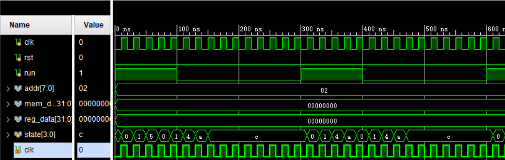
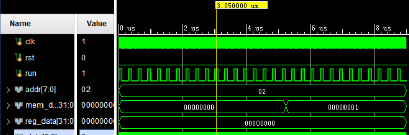

# Lab5 多周期MIPS-CPU

## 逻辑设计 & 核心代码

代码中大部分都应该通过组合逻辑实现，事实上时序逻辑只需要用在几个寄存器的写入和状态机中。

### ALU

此 ALU 的设计与 Lab1 稍有不同，但大致设计相似。需要支持的操作有 `ADD`, `AND`, `SUB`, `OR`, `XOR`, `NOR`, `SLT`。并且 flag 信号只需要一个，即 zero，故相对比较简单。

例如，可以这样实现 `ADD` 操作：

```verilog
always @(*) begin
    case (op) 
        `ALU_ADD: res = srca + srcb;
        // --snippet--
        default: res = srca;
    endcase
end
```

以及 zero flag：

```verilog
assign zero = res == 0;
```

### `alu_op` 控制信号

由于此实验要求支持 I 类指令，与书本上的不同，`alu_op` 只用两位表示的方式是行不通的。因为 I 类指令并没有 funct 域。故需要通过 6 位的 opcode 和 6 位的 funct 域来生成 4 位的 `alu_op` 信号。如下所示：

```verilog
always @(*) begin
    case (op)
        `R: begin 
            case (funct) 
                `ADD_FUNCT: alu_op = `ALU_ADD;
                // --snippet--
            endcase
        end
        // --snippet
        `BNE: alu_op = `ALU_SUB;
        default: alu_op = `ALU_ADD;
    endcase
end
```

注意，像 `BEQ` 和 `BNE` 这样的操作需要的 ALU 功能实际是 `SUB`。

### 控制信号

控制信号通过纯组合逻辑实现，只需要一些 case 即可。如下：

```verilog
always @ (next_state) begin
    case (next_state)
    SIf: begin 
        sig_reg_dst = 0;
        sig_reg_w = 0;
        sig_alu_srca = 0;
        sig_alu_srcb = 1;
        sig_pc_src = 0;
        sig_pc_wcond = 0;
        sig_pc_wncond = 0;
        sig_pc_w = 1;
        sig_IorD = 0;
        sig_mem_r = 1;
        sig_mem_w = 0;
        sig_mem_reg = 0;
        sig_ir_w = 1;
        sig_alu_op = `ALU_ADD;
    end
    // --snippet--
    endcase
end
```

### ddu的按键信号

需要将 ddu 部分的按键从连续信号转化为脉冲信号，此脉冲信号持续一个 cpu 时钟周期的时间即可。在实现的过程中，用 `last_key` 表示上一时钟周期的信号，`key` 表示此时钟周期的信号，则产生的脉冲信号可以表示为：

```verilog
assign key_pressed_event = ~last_key & key;
```

### cpu

有了上面的一些模块后，实现 cpu 就很简单了，只需要按照设计图将该连的线连起来就可以了。之前 lab2 写的 regfile 和 MEM 也需要通过 MUX 和寄存器等连接在一起。

#### pc

实现 cpu 中的 pc 是一个典型的例子。在实现过程中，pc 是一个由 `pc_we` 使能信号控制的寄存器。`npc` 则是一个 `wire` 变量，它通过三个信号和一个 MUX 生成。如下：

```verilog
assign npc = (sig_pc_src == 0) ? alu_res :
             (sig_pc_src == 1) ? alu_out :
                                 jmp_addr;
                                                             
assign jmp_addr = {pc[31:28], ir[25:0], 2'b00};

assign pc_we = sig_pc_w | (zero & sig_pc_wcond) | (~zero & sig_pc_wncond);

always @(posedge clk) begin
    if (rst) begin
        pc <= 0;
    end else if (pc_we) begin
        pc <= npc;
    end
end
```

根据 `sig_pc_src` 信号，`npc` 选择 `alu_res`, `alu_out`, `jmp_addr` 中的一个。而 `pc_we` 则取决于 `sig_pc_w`，`zero & sig_pc_wcond`, `~zero & sig_pc_wncond`。对应于四种情况：

- IF 周期
- 无条件跳转指令
- BEQ 指令
- BNE 指令

其它几个 MUX 的实现和这个寄存器类似。

#### State Machine

总共有 13 个状态，包括设计图中的几个状态加上 I 类指令的状态，及一个用于实现 ddu 单步调试的 Idle 状态：

```verilog
assign next_state = 
    (state == SIf)   ? SId :
    (state == SId)   ? (opcode == `R)   ? SREx :
                       (opcode == `BEQ) ? SBEx :
                       (opcode == `BNE) ? SBNEx:
                       (opcode == `LW)  ? SLSEx:
                       (opcode == `SW)  ? SLSEx:
                       (opcode == `J)   ? SJEx :
                                          SIEx :
    (state == SLSEx) ? (opcode == `LW)  ? SLMem:
                                          SSMem:
    (state == SREx)  ? SRMem:
    (state == SIEx)  ? SIMem:
    (state == SLMem) ? SWb  :
                       run  ? SIf  :
                              SIdle;
```

实现状态的组合逻辑如上所示（因为我将 next_state 设为了 `wire` 型，不想使用 always case 来实现，所有通过三元操作符 `?:` 来实现此组合逻辑。从上面的代码中可以很清楚的看到状态的变化。之后只需要在时钟上升沿设置状态即可：

```verilog
always @ (posedge clk) begin
    if (rst) begin
        state <= SIdle;
    end else begin
        state <= next_state;
    end
end 
```

### DDU

ddu 需要负责显示信号，这个可以直接使用上学期写的七段数码管驱动：

```verilog
wire [`BITS-1:0] data = mem ? mem_data : reg_data;

seg_displayer disp (
    .x(data),
    .clk_50mhz(clk_50mhz),
    .an(an),
    .dp(dp),
    .seg(seg)
);
```

然后，需要将按键转化为脉冲信号，如：

```verilog
wire step_prs;
keypressed step_prs_event (
    .key(step),
    .clk(clk_50mhz),
    .event_pressed(step_prs)
);
```

再根据 `inc_prs` 和 `dec_prs` 的脉冲信号，在时钟上升沿改变地址：

```verilog
always @ (posedge clk_50mhz) begin
    addr <= addr + inc_prs - dec_prs;
end
```

再根据 continue 和单步调式信号生成 `run`：

```verilog
assign run = cont | step_prs;
```

## 仿真 & 结果分析

仿真代码见[后面](#仿真代码)，如下是 `cpu_test.v` 的结果：



发现只有当 `run` 为 0 时，cpu 在执行完当条指令之后，会停留在 `SIdle` 状态。而当 `run` 为 1 时，cpu 不会进入 `SIdle` 状态，或者会从 `SIdle` 状态进入取指阶段。



发现最终 `mem_data` 变为了1.

## 下载 & 结果分析

内存中地址为 0 处的值：


内存中地址为 0x08 处的值：


## 完整代码

### `define.vh`

```verilog
`define BITS 32
`define REG_ADDR 5
`define REG_SIZE 32
`define ADDR_BITS 8

`define OP_BITS 6

`define R 6'b000000
`define ADDI 6'b001000
`define ANDI 6'b001100
`define BEQ 6'b000100
`define BNE 6'b000101
`define LW 6'b100011
`define ORI 6'b001101
`define XORI 6'b001110
`define SW 6'b101011
`define J 6'b000010
`define SLTI 6'b001010

`define FUNCT_BITS 6

`define ADD_FUNCT 6'b100000
`define AND_FUNCT 6'b100100
`define SUB_FUNCT 6'b100010
`define OR_FUNCT 6'b100101
`define XOR_FUNCT 6'b100110
`define NOR_FUNCT 6'b100111
`define SLT_FUNCT 6'b101010

`define ALU_OP_BITS 4

`define ALU_ADD 4'b0000
`define ALU_SUB 4'b0001
`define ALU_AND 4'b0010
`define ALU_OR 4'b0011
`define ALU_XOR 4'b0100
`define ALU_NOR 4'b0101
`define ALU_SLT 4'b0110
```

### `alu.v`

```verilog
`include "define.vh"

module alu(
    input [`BITS-1:0] srca,
    input [`BITS-1:0] srcb,
    input [`ALU_OP_BITS-1:0] op,
    output zero,
    output reg [`BITS-1:0] res
    );
    
    always @(*) begin
        case (op) 
            `ALU_ADD: res = srca + srcb;
            `ALU_AND: res = srca & srcb;
            `ALU_SUB: res = srca - srcb;
            `ALU_OR: res = srca | srcb;
            `ALU_XOR: res = srca ^ srcb;
            `ALU_NOR: res = ~(srca | srcb);
            `ALU_SLT: res = (srca < srcb) | (srca[`BITS-1] & ~srcb[`BITS-1]);
            default: res = srca;
        endcase
    end
        
    assign zero = res == 0;
    
endmodule
```

### `alu_ctrl.v`

```verilog
`include "define.vh"

module alu_ctrl(
    input [`OP_BITS-1:0] op,
    input [`FUNCT_BITS-1:0] funct,
    output reg [`ALU_OP_BITS-1:0] alu_op
    );
    
    always @(*) begin
        case (op)
            `R: begin 
                case (funct) 
                    `ADD_FUNCT: alu_op = `ALU_ADD;
                    `AND_FUNCT: alu_op = `ALU_AND;
                    `OR_FUNCT: alu_op = `ALU_OR;
                    `XOR_FUNCT: alu_op = `ALU_XOR;
                    `NOR_FUNCT: alu_op = `ALU_NOR;
                    `SUB_FUNCT: alu_op = `ALU_SUB;
                    `SLT_FUNCT: alu_op = `ALU_SLT;
                    default: alu_op = `ALU_ADD;
                endcase
            end
            `ADDI: alu_op = `ALU_ADD;
            `ANDI: alu_op = `ALU_AND;
            `ORI: alu_op = `ALU_OR;
            `XORI: alu_op = `ALU_XOR;
            `SLTI: alu_op = `ALU_SLT;
            `LW: alu_op = `ALU_ADD;
            `SW: alu_op = `ALU_ADD;
            `BEQ: alu_op = `ALU_SUB;
            `BNE: alu_op = `ALU_SUB;
            default: alu_op = `ALU_ADD;
        endcase
    end
endmodule
```

### `sig_ctrl.v`

```verilog
`include "define.vh"

module sig_ctrl(
    input [3:0] next_state,
    input [`ALU_OP_BITS-1:0] alu_op,
    output reg sig_reg_dst,
    output reg sig_reg_w,
    output reg sig_alu_srca,
    output reg [1:0] sig_alu_srcb,
    output reg [1:0] sig_pc_src,
    output reg sig_pc_wcond,
    output reg sig_pc_wncond,
    output reg sig_pc_w,
    output reg sig_IorD,
    output reg sig_mem_r,
    output reg sig_mem_w,
    output reg sig_mem_reg,
    output reg sig_ir_w,
    output reg [`ALU_OP_BITS-1:0] sig_alu_op
    );

    localparam SIf  = 0,
               SId  = 1,
               SLSEx = 2,
               SREx  = 3,
               SIEx = 4,
               SJEx = 5,
               SBEx = 6,
               SBNEx = 13,
               SLMem = 7,
               SSMem = 8,
               SRMem = 9,
               SIMem = 10,
               SWb  = 11,
               SStart = 12;
    
    
    always @ (next_state) begin
        case (next_state)
        SIf: begin 
            sig_reg_dst = 0;
            sig_reg_w = 0;
            sig_alu_srca = 0;
            sig_alu_srcb = 1;
            sig_pc_src = 0;
            sig_pc_wcond = 0;
            sig_pc_wncond = 0;
            sig_pc_w = 1;
            sig_IorD = 0;
            sig_mem_r = 1;
            sig_mem_w = 0;
            sig_mem_reg = 0;
            sig_ir_w = 1;
            sig_alu_op = `ALU_ADD;
        end
        SId: begin
            sig_reg_dst = 0;
            sig_reg_w = 0; 
            sig_alu_srca = 0;
            sig_alu_srcb = 3;
            sig_pc_src = 0;
            sig_pc_wcond = 0;
            sig_pc_wncond = 0;
            sig_pc_w = 0;
            sig_IorD = 0;
            sig_mem_r = 0;
            sig_mem_w = 0;
            sig_mem_reg = 0;
            sig_ir_w = 0;
            sig_alu_op = `ALU_ADD;
        end
        SLSEx: begin
            sig_reg_dst = 0;
            sig_reg_w = 0;
            sig_alu_srca = 1;
            sig_alu_srcb = 2;
            sig_pc_src = 0;
            sig_pc_wcond = 0;
            sig_pc_wncond = 0;
            sig_pc_w = 0;
            sig_IorD = 0;
            sig_mem_r = 0;
            sig_mem_w = 0;
            sig_mem_reg = 0;
            sig_ir_w = 0;
            sig_alu_op = alu_op;
        end
        SREx: begin
            sig_reg_dst = 0;
            sig_reg_w = 0;
            sig_alu_srca = 1;
            sig_alu_srcb = 0;
            sig_pc_src = 0;
            sig_pc_wcond = 0;
            sig_pc_wncond = 0;
            sig_pc_w = 0;
            sig_IorD = 0;
            sig_mem_r = 0;
            sig_mem_w = 0;
            sig_mem_reg = 0;
            sig_ir_w = 0;    
            sig_alu_op = alu_op;         
        end
        SBEx: begin
            sig_reg_dst = 0;
            sig_reg_w = 0;
            sig_alu_srca = 1;
            sig_alu_srcb = 0;
            sig_pc_src = 1;
            sig_pc_wcond = 1;
            sig_pc_wncond = 0;
            sig_pc_w = 0;
            sig_IorD = 0;
            sig_mem_r = 0;
            sig_mem_w = 0;
            sig_mem_reg = 0;
            sig_ir_w = 0;     
            sig_alu_op = alu_op;       
        end
        SBNEx: begin
            sig_reg_dst = 0;
            sig_reg_w = 0;
            sig_alu_srca = 1;
            sig_alu_srcb = 0;
            sig_pc_src = 1;
            sig_pc_wcond = 0;
            sig_pc_wncond = 1;
            sig_pc_w = 0;
            sig_IorD = 0;
            sig_mem_r = 0;
            sig_mem_w = 0;
            sig_mem_reg = 0;
            sig_ir_w = 0;     
            sig_alu_op = alu_op;       
        end
        SJEx: begin
            sig_reg_dst = 0;
            sig_reg_w = 0;
            sig_alu_srca = 1;
            sig_alu_srcb = 2;
            sig_pc_src = 2;
            sig_pc_wcond = 0;
            sig_pc_wncond = 0;
            sig_pc_w = 1;
            sig_IorD = 0;
            sig_mem_r = 0;
            sig_mem_w = 0;
            sig_mem_reg = 0;
            sig_ir_w = 0;
            sig_alu_op = alu_op;
        end
        SIEx: begin
            sig_reg_dst = 0;
            sig_reg_w = 0;
            sig_alu_srca = 1;
            sig_alu_srcb = 2;
            sig_pc_src = 0;
            sig_pc_wcond = 0;
            sig_pc_wncond = 0;
            sig_pc_w = 0;
            sig_IorD = 0;
            sig_mem_r = 0;
            sig_mem_w = 0;
            sig_mem_reg = 0;
            sig_ir_w = 0;
            sig_alu_op = alu_op;        
        end
        SLMem: begin
            sig_reg_dst = 0;
            sig_reg_w = 0;
            sig_alu_srca = 1;
            sig_alu_srcb = 2;
            sig_pc_src = 0;
            sig_pc_wcond = 0;
            sig_pc_wncond = 0;
            sig_pc_w = 0;
            sig_IorD = 1;
            sig_mem_r = 1;
            sig_mem_w = 0;
            sig_mem_reg = 0;
            sig_ir_w = 0;  
            sig_alu_op = alu_op;      
        end
        SSMem: begin 
            sig_reg_dst = 0;
            sig_reg_w = 0;
            sig_alu_srca = 1;
            sig_alu_srcb = 2;
            sig_pc_src = 0;
            sig_pc_wcond = 0;
            sig_pc_wncond = 0;
            sig_pc_w = 0;
            sig_IorD = 1;
            sig_mem_r = 0;
            sig_mem_w = 1;
            sig_mem_reg = 0;
            sig_ir_w = 0;   
            sig_alu_op = alu_op;
        end
        SRMem: begin
            sig_reg_dst = 1;
            sig_reg_w = 1;
            sig_alu_srca = 1;
            sig_alu_srcb = 2;
            sig_pc_src = 0;
            sig_pc_wcond = 0;
            sig_pc_wncond = 0;
            sig_pc_w = 0;
            sig_IorD = 0;
            sig_mem_r = 0;
            sig_mem_w = 0;
            sig_mem_reg = 0;
            sig_ir_w = 0;    
            sig_alu_op = alu_op;        
        end
        SIMem: begin
            sig_reg_dst = 0;
            sig_reg_w = 1;
            sig_alu_srca = 1;
            sig_alu_srcb = 2;
            sig_pc_src = 0;
            sig_pc_wcond = 0;
            sig_pc_wncond = 0;
            sig_pc_w = 0;
            sig_IorD = 0;
            sig_mem_r = 0;
            sig_mem_w = 0;
            sig_mem_reg = 0;
            sig_ir_w = 0;    
            sig_alu_op = alu_op;        
        end
        SWb: begin
            sig_reg_dst = 0;
            sig_reg_w = 1;
            sig_alu_srca = 1;
            sig_alu_srcb = 2;
            sig_pc_src = 0;
            sig_pc_wcond = 0;
            sig_pc_wncond = 0;
            sig_pc_w = 0;
            sig_IorD = 0;
            sig_mem_r = 0;
            sig_mem_w = 0;
            sig_mem_reg = 1;
            sig_ir_w = 0;
            sig_alu_op = alu_op;
        end
        SStart: begin
            sig_reg_dst = 0;
            sig_reg_w = 0;
            sig_alu_srca = 0;
            sig_alu_srcb = 0;
            sig_pc_src = 0;
            sig_pc_wcond = 0;
            sig_pc_wncond = 0;
            sig_pc_w = 0;
            sig_IorD = 0;
            sig_mem_r = 0;
            sig_mem_w = 0;
            sig_mem_reg = 0;
            sig_ir_w = 0;
            sig_alu_op = alu_op;
        end
        endcase
    end 
    
endmodule
```

### `keypressed.v`

```verilog
module keypressed(
    input key,
    input clk,
    output event_pressed
    );
    reg [22:0] count;
    
    reg cur_key;
    // is key pressed or released in last cycle
    reg prev_key;
    assign event_pressed = (~prev_key) & cur_key;
    
    initial begin count = 0; end
    
    always @ (posedge clk) begin
        prev_key <= cur_key;
    end
    
    always @ (posedge clk) begin
        if (count >= 23'd499999) begin
            count <= 0;
            cur_key <= key;
        end 
        else count <= count + 1;
    end
    
endmodule
```

### `cpu.v`

```verilog
`include "define.vh"

module cpu(
    input clk,
    input rst,
    input run,
    input [`ADDR_BITS-1:0] ddu_addr,
    output [`BITS-1:0] ddu_mem,
    output [`BITS-1:0] ddu_reg,
    output [`ADDR_BITS-1:0] pc_out
    );
    
    // signal
    wire sig_reg_dst;
    wire sig_reg_w;
    wire sig_alu_srca;
    wire [1:0] sig_alu_srcb;
    wire [1:0] sig_pc_src;
    wire sig_pc_wcond;
    wire sig_pc_wncond;
    wire sig_pc_w;
    wire sig_IorD;
    wire sig_mem_r; // perhaps i won't use this
    wire sig_mem_w;
    wire sig_mem_reg;
    wire sig_ir_w;
    wire [`ALU_OP_BITS-1:0] sig_alu_op;
    
    reg [`BITS-1:0] pc;
    wire [`BITS-1:0] npc;
    wire pc_we;
    wire [`BITS-1:0] jmp_addr;
    reg [`BITS-1:0] ir;
    reg [`BITS-1:0] mdr;
    wire [5:0] opcode;
    
    assign npc = (sig_pc_src == 0) ? alu_res :
                 (sig_pc_src == 1) ? alu_out :
                                     jmp_addr;
                                     
    assign opcode = ir[31:26];
                                   
    assign jmp_addr = {pc[31:28], ir[25:0], 2'b00};
    
    assign pc_we = sig_pc_w | (zero & sig_pc_wcond) | (~zero & sig_pc_wncond);
    
    always @(posedge clk) begin
        if (rst) begin
            pc <= 0;
        end else if (pc_we) begin
            pc <= npc;
        end
    end
    
    always @(posedge clk) begin
        if (sig_ir_w)
            ir <= mem_dout;
    end
    
    always @(posedge clk) begin
        alu_out <= alu_res;
        mdr <= mem_dout;
        rda <= rd1;
        rdb <= rd2;
    end

    wire [`ADDR_BITS-1:0] mem_addr;
    wire [`BITS-1:0] mem_din;
    wire [`BITS-1:0] mem_dout;
    wire [`BITS-1:0] tmp_mem_addr;
        
    dist_mem_gen_0 memory (
        .a(mem_addr),
        .d(mem_din),
        .spo(mem_dout),
        .clk(clk),
        .we(sig_mem_w),
        .dpra(ddu_addr),
        .dpo(ddu_mem)
    );
    
    assign mem_din = rdb;
    assign tmp_mem_addr = sig_IorD ? alu_out : pc;
    assign mem_addr = tmp_mem_addr[`ADDR_BITS+1:2];

    wire [`REG_ADDR-1:0] ra1;
    wire [`REG_ADDR-1:0] ra2;
    wire [`REG_ADDR-1:0] wa;
    wire reg_we;
    wire [`BITS-1:0] wd;
    wire [`BITS-1:0] rd1;
    wire [`BITS-1:0] rd2;
    reg [`BITS-1:0] rda;
    reg [`BITS-1:0] rdb;
    
    regfile #(`BITS, `REG_SIZE, `REG_ADDR) regs (
        .rst(rst),
        .clk(clk),
        .rAddr0(ra1),
        .rAddr1(ra2),
        .rAddr2(ddu_addr),
        .wAddr(wa),
        .wDin(wd),
        .wEn(reg_we),
        .rDout0(rd1),
        .rDout1(rd2),
        .rDout2(ddu_reg)
    );
    
    assign reg_we = sig_reg_w;
    assign wa = sig_reg_dst ? ir[15:11] : ir[20:16];
    assign wd = sig_mem_reg ? mdr : alu_out;
    assign ra1 = ir[25:21];
    assign ra2 = ir[20:16];
    
    wire [`BITS-1:0] alu_srca,
                     alu_srcb,
                     alu_res;
    wire zero;
    wire [`ALU_OP_BITS-1:0] alu_op;
    reg [`BITS-1:0] alu_out;
    
    wire [`BITS-1:0] imm_ext;
    wire [`BITS-1:0] imm_shf;
    
    alu _alu (
        .srca(alu_srca),
        .srcb(alu_srcb),
        .op(sig_alu_op),
        .res(alu_res),
        .zero(zero)
    );
    
    alu_ctrl _alu_ctrl (
        .op(opcode),
        .funct(ir[5:0]),
        .alu_op(alu_op)
    );
    
    assign imm_ext = { {16{ir[15]}}, ir[15:0] };
    assign imm_shf = imm_ext << 2;
    assign alu_srca = sig_alu_srca ? rda : pc;
    assign alu_srcb = (sig_alu_srcb == 0) ? rdb    :
                      (sig_alu_srcb == 1) ? 4      :
                      (sig_alu_srcb == 2) ? imm_ext:
                                            imm_shf;
    
    // control
    localparam SIf  = 0,
               SId  = 1,
               SLSEx = 2,
               SREx  = 3,
               SIEx = 4,
               SJEx = 5,
               SBEx = 6,
               SBNEx = 13,
               SLMem = 7,
               SSMem = 8,
               SRMem = 9,
               SIMem = 10,
               SWb  = 11,
               SIdle = 12;
               
    reg [3:0] state;
    wire [3:0] next_state;
    
    // just not want to use case
    assign next_state = 
        (state == SIf)   ? SId :
        (state == SId)   ? (opcode == `R)   ? SREx :
                           (opcode == `BEQ) ? SBEx :
                           (opcode == `BNE) ? SBNEx:
                           (opcode == `LW)  ? SLSEx:
                           (opcode == `SW)  ? SLSEx:
                           (opcode == `J)   ? SJEx :
                                              SIEx :
        (state == SLSEx) ? (opcode == `LW)  ? SLMem:
                                              SSMem:
        (state == SREx)  ? SRMem:
        (state == SIEx)  ? SIMem:
        (state == SLMem) ? SWb  :
                           run  ? SIf  :
                                  SIdle;
                         
    
    always @ (posedge clk) begin
        if (rst) begin
            state <= SIdle;
        end else begin
            state <= next_state;
        end
    end 
    
    initial begin
        state = SIdle;
        pc = 0;
    end
    
    sig_ctrl _sig_ctrl (
        next_state,
        alu_op,
        sig_reg_dst,                 
        sig_reg_w,                   
        sig_alu_srca,                
        sig_alu_srcb,          
        sig_pc_src,            
        sig_pc_wcond,                
        sig_pc_wncond,               
        sig_pc_w,                    
        sig_IorD,                    
        sig_mem_r,                   
        sig_mem_w,                   
        sig_mem_reg,                 
        sig_ir_w,                    
        sig_alu_op
    );
    
    // not relevant to cpu
    assign pc_out = pc[`ADDR_BITS+1:2];
    
endmodule
```

### `ddu.v`

```verilog
`include "define.vh"

module ddu(
    input cont,
    input step,
    input mem,
    input inc,
    input dec,
    input [`BITS-1:0] mem_data,
    input [`BITS-1:0] reg_data,
    input [`ADDR_BITS-1:0] pc,
    input clk_50mhz,
    output run,
    output reg [`ADDR_BITS-1:0] addr,
    output [15:0] led,
    output [7:0] an,
    output [6:0] seg,
    output dp
    );
    
    wire [`BITS-1:0] data = mem ? mem_data : reg_data;
    
    seg_displayer disp (
        .x(data),
        .clk_50mhz(clk_50mhz),
        .an(an),
        .dp(dp),
        .seg(seg)
    );
    
    wire inc_prs;
    keypressed inc_prs_event (
        .key(inc),
        .clk(clk_50mhz),
        .event_pressed(inc_prs)
    );
    
    wire dec_prs;
    keypressed dec_prs_event (
        .key(dec),
        .clk(clk_50mhz),
        .event_pressed(dec_prs)
    );
    
    wire step_prs;
    keypressed step_prs_event (
        .key(step),
        .clk(clk_50mhz),
        .event_pressed(step_prs)
    );
    
    initial begin
        addr = 0;
    end
    
    always @ (posedge clk_50mhz) begin
        addr <= addr + inc_prs - dec_prs;
    end
    
    assign run = cont | step_prs;
    
    assign led[15:8] = pc;
    assign led[7:0] = addr;
    
endmodule
```

### `top.v`

```verilog
`include "define.vh"

module top(
    input cont,
    input step,
    input mem,
    input inc,
    input dec,
    input clk,
    input rst,
    output [15:0] led,
    output [7:0] an,
    output [6:0] seg,
    output dp
    );
    
    wire clk_50mhz;
    
    clk_wiz_0 clock_50mhz (
        .clk_in1(clk),
        .clk_out1(clk_50mhz)
    );
    
    wire run;
    wire [`ADDR_BITS-1:0] addr;
    wire [`BITS-1:0] mem_data;
    wire [`BITS-1:0] reg_data;
    wire [`ADDR_BITS-1:0] pc;
    
    cpu _cpu (
        .clk(clk_50mhz),
        .run(run),
        .ddu_addr(addr),
        .ddu_mem(mem_data),
        .ddu_reg(reg_data),
        .pc_out(pc),
        .rst(rst)
    );
    
    ddu _ddu (
        .cont(cont),
        .step(step),
        .mem(mem),
        .inc(inc),
        .dec(dec),
        .mem_data(mem_data),
        .reg_data(reg_data),
        .pc(pc),
        .clk_50mhz(clk_50mhz),
        .run(run),
        .addr(addr),
        .led(led),
        .seg(seg),
        .an(an),
        .dp(dp)
    );
    
    
endmodule
```

### 仿真代码

#### `cpu_test.v`

```verilog
module cpu_test(
    );
    
    reg clk;
    reg rst;
    reg run;
    
    initial begin clk = 0; rst = 0; run = 1; end
    always #10 clk = ~clk;
    
    always begin
        #100 run = 0;
        #200 run = 1;
    end
    
    wire [7:0] addr = 8'h2;
    wire [31:0] mem_data, reg_data;
    cpu _cpu (
        .clk(clk),
        .run(run),
        .rst(rst),
        .ddu_addr(addr),
        .ddu_mem(mem_data),
        .ddu_reg(reg_data)
    );
    
endmodule
```

#### `top_test.v`

```verilog
module top_test(

    );
    
    reg cont,      
        step,      
        mem,       
        inc,       
        dec,       
        clk,       
        rst;     
    wire [15:0] led;
    wire [7:0] an;
    wire [6:0] seg;
    wire dp;
    
    top _top (
        cont,      
        step,      
        mem,       
        inc,       
        dec,       
        clk,       
        rst,       
        led,
        an, 
        seg,
        dp
    );       
    
    initial begin clk = 0; rst = 0; inc = 0; dec = 0; cont = 1; step = 0; mem = 0; end
    
    always #5 clk = ~clk;
    
    always begin
    #100 cont = 0;
    #5 step = 1;
    #10 step = 0;
    end
endmodule
```

